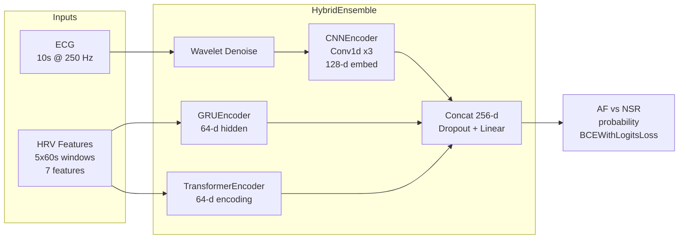
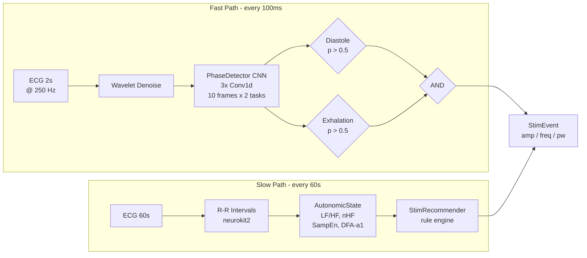

# RS-Personalized AI-Driven Adaptive Stimulation

Offline-trainable, online-capable AI pipelines for auricular vagus nerve stimulation (aVNS). Three independent pipelines share a common signal processing core and closed-loop inference architecture.

| Branch | Pipeline | Signals | Gate | Target |
|---|---|---|---|---|
| `master` | AF vs NSR classification | ECG | Classification | AUROC >= 0.75 |
| `feature/stroke-avns` | Stroke bifold closed-loop VNS | ECG | Diastole + Exhalation | >85% accuracy, <200ms latency |
| `feature/tinnitus-avns` | Tinnitus tri-fold closed-loop VNS | PPG + EDA | Diastole + Exhalation + Arousal | >80% arousal AUROC, <50ms latency |

---

## Setup

```bash
python -m venv .venv
.venv/Scripts/activate          # Windows
pip install -r requirements.txt
```

---

## 1. AF Pipeline — AF vs NSR Classification

**Branch:** `master` | **Config:** `config.yaml`

Detects atrial fibrillation vs normal sinus rhythm from 10s ECG + 5-minute HRV sequence. Output gates the Sparrow Link pulse generator via a StimRecommender rule engine.

### Architecture



### HRV Features (7)

RMSSD, SDNN, LF power, HF power, LF/HF ratio, Sample Entropy, DFA alpha1

### Training

```bash
# Two-phase transfer learning
.venv/Scripts/python -m src.training.train --use-cache                  # Phase 2 fine-tune
.venv/Scripts/python -m src.training.precompute_cache --workers 4       # Rebuild cache

# Demo (no dataset required)
.venv/Scripts/python scripts/demo_af_pipeline.py
```

### Datasets

| Dataset | Role |
|---|---|
| MIT-BIH AF (`afdb/`) | Training + evaluation |
| Normal Sinus Rhythm (`nsrdb/`) | Training + evaluation |
| MIMIC-III (`mimic3/`) | Phase 1 pre-training |
| Challenge 2017 (`challenge2017/`) | OOD evaluation |

### Targets

- AUROC >= 0.75 on held-out test (NFR-2.1)
- <5% cross-dataset performance drop (NFR-3.1)

---

## 2. Stroke Pipeline — Bifold Closed-Loop VNS

**Branch:** `feature/stroke-avns` | **Config:** `config_stroke.yaml`

Real-time bifold trigger for stroke patients. Stimulates only during simultaneous cardiac diastole **and** respiratory exhalation — the vagal tone peak. A slow path adapts stimulation parameters to HRV-derived autonomic state.

### Architecture



### Validation Results (CVES, 228 records)

| Task | In-Distribution | OOD (SHaRe) |
|---|---|---|
| Diastole accuracy | **84.3%** | 81.1% |
| Exhalation accuracy | 56.5% | ~50% |
| Latency p95 | **116ms** | — |

Diastole nearly meets the >85% go/no-go threshold. Exhalation accuracy is capped by ECG-only labels — hardware respiratory signal needed to reach >85%.

### Demo

```bash
git checkout feature/stroke-avns
.venv/Scripts/python scripts/demo_stroke_pipeline.py
```

---

## 3. Tinnitus Pipeline — Tri-Fold Closed-Loop VNS

**Branch:** `feature/tinnitus-avns` | **Config:** `config_tinnitus.yaml`

Tri-fold closed-loop trigger for tinnitus suppression using **PPG** (not ECG). Stimulates only when cardiac diastole, respiratory exhalation, **and** EDA arousal-in-band are simultaneously satisfied. A trained GBT classifier gates the EDA path.

### Architecture

```mermaid
flowchart LR
    subgraph Fast Path - every 100ms
        PPG[PPG 2s<br>@ 125 Hz] --> DN[Bandpass<br>0.5-8 Hz]
        DN --> PD2[PhaseDetector CNN<br>10 frames x 2 tasks]
        PD2 --> DIA2{Diastole<br>p > 0.65 x3}
        PD2 --> EXH2{Exhalation<br>p > 0.5}
    end

    subgraph EDA Path - each feed call
        EDA[EDA<br>@ 4 Hz] --> AG[ArousalGate<br>ring buffer]
        TEMP[Skin Temp<br>optional] -.-> AG
        AG --> GBT[GBT Classifier<br>5-6 EDA features<br>WESAD-trained]
        GBT --> ARO{Arousal<br>in-band?}
    end

    subgraph Slow Path - every 60s
        PPG60[PPG 60s] --> RR2[R-R Intervals]
        RR2 --> AS2[AutonomicState]
        AS2 --> SR2[StimRecommender]
    end

    DIA2 --> AND2{AND<br>all 3}
    EXH2 --> AND2
    ARO --> AND2
    AND2 --> STIM2[TinnitusStimEvent<br>amp / freq / pw]
    SR2 --> STIM2
```

### Validation Results (WESAD, 15 subjects, 75 epochs)

| Metric | F16 (v1) | F22 (v2) | Notes |
|---|---|---|---|
| Arousal classifier AUROC | — | **0.930** | Exceeds SBIR >80% target |
| Tri-fold precision | 0.065 | 0.052 | 1 in 19 stims hits true window |
| Tri-fold recall | 0.271 | 0.004 | v2 over-suppresses (N=3 gate) |
| Stim rate (/min) | 206 | **3.2** | 98.5% reduction via F17 |
| Exhalation precision | 0.383 | **0.448** | +6.5pp from dedicated model |

**Key finding:** The EDA arousal gate successfully suppresses stimulation during stress epochs (S7: 588 → 44 stim/min). Phase detector accuracy (avg 61.7%) is the primary bottleneck — improving diastole/exhalation detection requires better training labels or a hardware respiratory signal.

### Demo

```bash
git checkout feature/tinnitus-avns
.venv/Scripts/python scripts/demo_tinnitus_pipeline.py
```

---

## Shared Components

| Module | AF | Stroke | Tinnitus |
|---|---|---|---|
| `src/models/cnn.py` CNNEncoder | Yes | No | No |
| `src/models/rnn.py` GRUEncoder | Yes | No | No |
| `src/models/transformer.py` TransformerEncoder | Yes | No | No |
| `src/models/ensemble.py` HybridEnsemble | Yes | No | No |
| `src/models/phase_detector.py` PhaseDetector | No | Yes (ECG) | Yes (PPG) |
| `src/models/autonomic_state.py` AutonomicState | No | Yes | Yes |
| `src/models/stim_recommender.py` StimRecommender | No | Yes | Yes |
| `src/models/closed_loop_pipeline.py` ClosedLoopPipeline | No | Yes | No |
| `src/models/tinnitus_closed_loop.py` TinnitusClosedLoopPipeline | No | No | Yes |
| `src/models/arousal_gate.py` ArousalGate | No | No | Yes |
| `src/models/arousal_classifier.py` ArousalClassifier | No | No | Yes |

---

## Project Structure

```
src/
  data/           Parsers for AFDB, NSRDB, MIMIC-III, CVES, BIDMC, WESAD
  features/       HRV, PPG filter, EDA, ECG-derived resp, wavelet denoise
  models/         All model classes + closed-loop pipelines
  training/       Train scripts, cache precompute, build_model
tests/            500+ tests across all three pipelines
scripts/          Demo scripts + utilities
models/
  checkpoints/    Trained weights (.pth, .pkl)
  artifacts/      Precomputed caches, train/val/test splits, eval results
config.yaml             AF pipeline config
config_tinnitus.yaml    Tinnitus pipeline config (feature/tinnitus-avns)
config_stroke.yaml      Stroke pipeline config (feature/stroke-avns)
```
